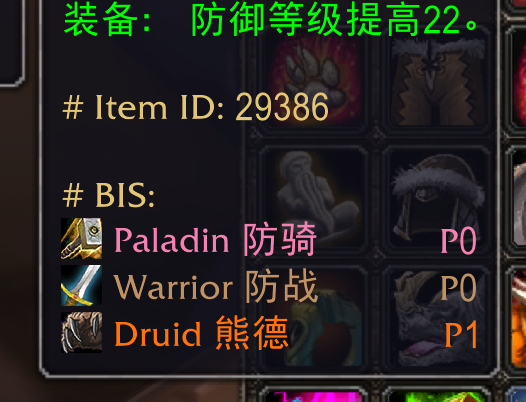
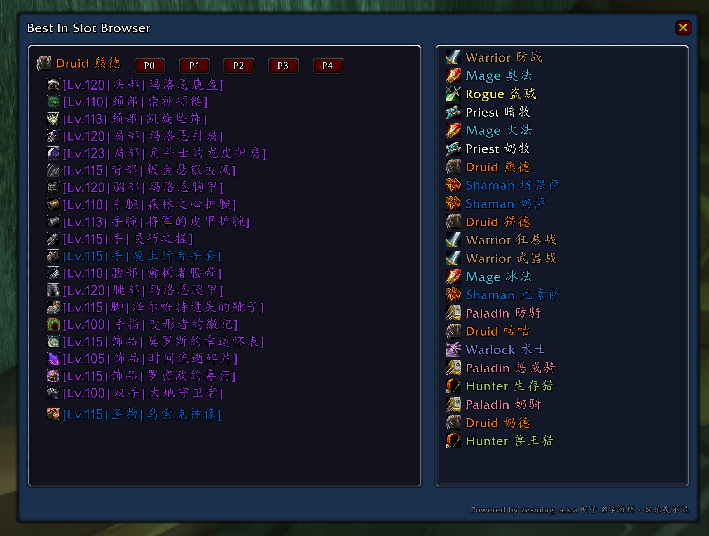

# Best In Slot

A WOW (Classic BBC) addon shows the BIS info on the gear tooltip, and check the list on a browser.

**ToolTip Information**



**Gear List Browser**



The BIS data is migrated from [ExoLink_BIS](https://bbs.nga.cn/read.php?tid=27318411&rand=250) @俏俏作品, It will change to use the @蓝色隐士 bis data in later.

If you want to customize BIS info, please go to the `Data/{class_you_want_to_edit}.lua`, and modify the Item regists info.

Example
```lua
local bis = BIS:RegisterClass("Druid", "熊德")  -- Class Info

...

BIS:BISItem(bis, "29098", "Head", "", 1)  -- Item info
```
