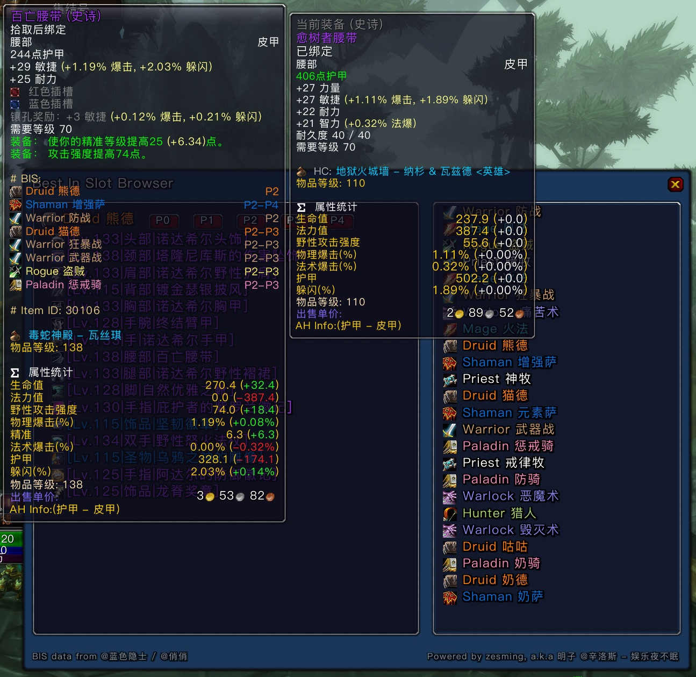

# Best In Slot

A WOW (Classic BBC) addon shows the BIS info on the gear tooltip, and check the list on a browser.

### Features
#### ToolTip Information



#### Gear List Browser


Type `/bb` or `/ybm` in the chat window to open the browser.

### Data Source

The BIS data was migrated from [ExoLink_BIS](https://bbs.nga.cn/read.php?tid=27318411&rand=250) @俏俏作品, and now it changes to use the @蓝色隐士 bis data (P0 - P2).

If you want to customize BIS info, please go to the `Data/{class_you_want_to_edit}.lua`, and modify the Item register info.

**Example**
```lua
local bis = BIS:RegisterClass("Druid", "熊德")  -- Class Info

...

BIS:BISItem(bis, "29098", "Head", "{anything you want to desc}", 1)  -- Item info
```
